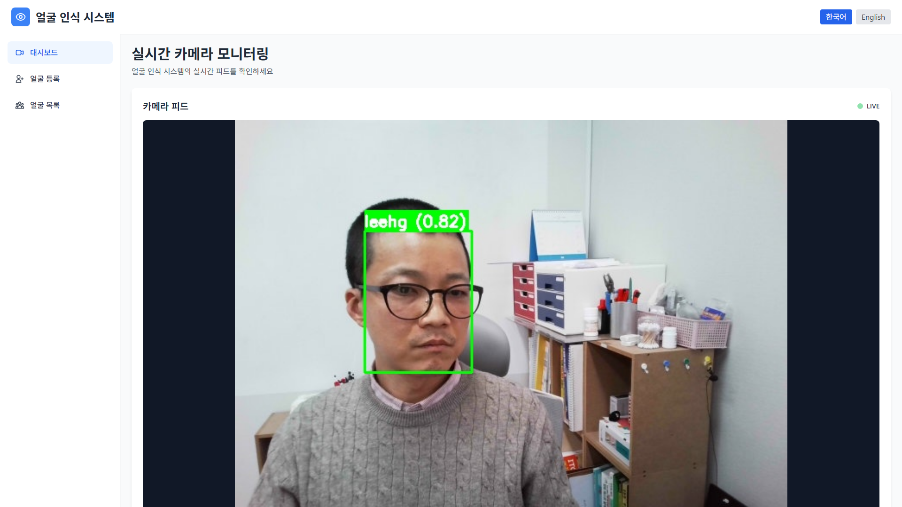
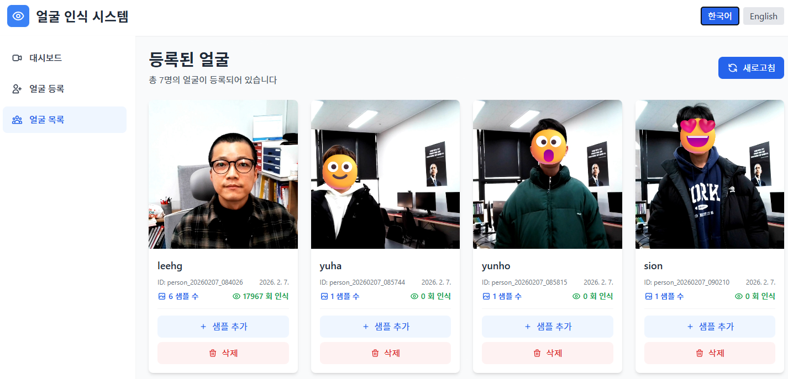

# 얼굴 인식 프로그램 (Face Recognition System)

실시간 얼굴 감지 및 인식 시스템

## 프로젝트 소개
카메라를 통한 실시간 얼굴 인식 및 웹 대시보드를 제공하는 시스템입니다.

## 주요 기능
- 실시간 카메라 연동
- Hugging Face 모델을 활용한 얼굴 인식
- 웹 기반 모니터링 대시보드
- 얼굴 등록 및 관리

## 기술 스택
- **Backend**: Python 3.9+, FastAPI, OpenCV
- **ML**: InsightFace (buffalo_l), PyTorch
- **Frontend**: React 19, Vite, Tailwind CSS, React Router
- **DevOps**: Git, GitHub

## 문서
- [PRD (제품 요구사항)](./PRD.md)
- [프로젝트 계획서](./PROJECT_PLAN.md)
- [학습 워크북 (Learning Workbook)](./LEARNING_WORKBOOK.md) - 프로젝트 관리자를 위한 기술 학습 가이드
- [API 가이드](./API_GUIDE.md) - FastAPI 서버 사용 방법
- [트러블슈팅 가이드](./TROUBLESHOOTING.md) - 설치 및 실행 문제 해결

## 프로젝트 구조
```
faceReco/
├── backend/                # 백엔드 서버
│   ├── app.py             # 메인 애플리케이션
│   ├── models/            # ML 모델 모듈
│   │   ├── face_detection.py      # Haar Cascade 얼굴 감지
│   │   ├── face_recognition.py    # InsightFace 얼굴 인식
│   │   └── face_database.py       # 얼굴 데이터베이스 관리
│   ├── camera/            # 카메라 처리 모듈
│   ├── api/               # API 엔드포인트
│   ├── data/              # 얼굴 데이터베이스
│   │   ├── face_database.json     # 메타데이터
│   │   ├── embeddings/            # 얼굴 임베딩 (512차원)
│   │   └── faces/                 # 얼굴 이미지
│   └── requirements.txt   # Python 의존성
├── frontend/              # 프론트엔드 (React + Vite)
│   ├── src/
│   │   ├── components/         # UI 컴포넌트
│   │   ├── pages/              # 페이지 (Dashboard, FaceRegistration, FaceList)
│   │   ├── services/           # API 서비스
│   │   └── utils/              # 유틸리티
│   └── package.json
├── docs/                  # 문서
├── tests/                 # 테스트 코드
├── PRD.md                 # 제품 요구사항
├── PROJECT_PLAN.md        # 프로젝트 계획서
└── README.md              # 이 파일
```

## 프로젝트 상태
현재 상태: **Milestone 5 - 웹 대시보드 개발 진행 중** 🚧

### 완료된 작업
**Milestone 1: 프로젝트 초기 설정** ✅
- [x] GitHub 리포지토리 생성
- [x] 프로젝트 디렉토리 구조 생성
- [x] Python 가상환경 설정
- [x] 기본 의존성 패키지 설치
- [x] 문서 작성 (PRD, PROJECT_PLAN, README)

**Milestone 2: 카메라 연동 및 기본 얼굴 감지** ✅
- [x] OpenCV 카메라 핸들러 구현
- [x] 실시간 비디오 스트림 처리
- [x] Haar Cascade 얼굴 감지 구현
- [x] 얼굴 영역 바운딩 박스 표시
- [x] 단위 테스트 작성

**Milestone 3: ML 모델 통합** ✅
- [x] InsightFace buffalo_l 모델 선정
- [x] FaceRecognizer 클래스 구현 (얼굴 임베딩 추출)
- [x] FaceDatabase 클래스 구현 (얼굴 데이터베이스 관리)
- [x] 얼굴 등록 기능 구현
- [x] 얼굴 인식 및 매칭 기능 구현
- [x] 단위 테스트 작성

**Milestone 4: Backend API 개발** ✅
- [x] FastAPI 프로젝트 초기화
- [x] API 엔드포인트 설계 및 구현
- [x] CORS 설정
- [x] 실시간 비디오 스트리밍 API
- [x] 얼굴 등록/조회/삭제 API
- [x] API 문서 작성 (Swagger UI)

**Milestone 5: 웹 대시보드 개발** 🚧
- [x] React + Vite 프론트엔드 프로젝트 초기화
- [x] 기본 레이아웃 구조 (Header, Sidebar, Layout)
- [x] 페이지 컴포넌트 (Dashboard, FaceRegistration, FaceList)
- [x] API 클라이언트 설정 (Axios)
- [ ] 실시간 카메라 모니터링 페이지 기능 강화
- [ ] 얼굴 등록 페이지 테스트
- [ ] 얼굴 목록 페이지 테스트

### 다음 단계
- [ ] 통합 테스트 및 성능 최적화 (Milestone 5)
- [ ] 배포 문서 작성 및 Docker 컨테이너화 (Milestone 6)

## 스크린샷

### 대시보드 - 실시간 얼굴 모니터링

메인 대시보드에서 실시간으로 얼굴을 감지하고 인식하며, 감지된 얼굴 수, 인식된 얼굴 수, 처리 속도(FPS) 등의 통계를 실시간으로 확인할 수 있습니다.

### 얼굴 등록

웹 인터페이스를 통해 카메라로 얼굴을 촬영하고 새로운 얼굴을 등록할 수 있습니다. 다국어 지원으로 한국어와 영어를 선택할 수 있습니다.

### 얼굴 목록 관리

등록된 모든 얼굴을 확인하고 관리할 수 있습니다. 얼굴 삭제 및 중복 감지 기능을 제공합니다.

## 주요 기능

### 다중 샘플 얼굴 인식
- 동일인의 여러 사진을 등록하여 인식 정확도 향상
- 자동 중복 감지 및 병합
- 모든 샘플 중 최대 유사도를 사용하여 인식

### 실시간 통계 대시보드
- 실시간 얼굴 감지 수
- 인식 성공률
- 처리 속도 (FPS)
- 매초 업데이트

### 포괄적인 테스트
- 프론트엔드 Playwright E2E 테스트
- 하드웨어 없이 테스트 가능한 웹캠 모킹
- API 통합 테스트

### 다국어 지원 (i18n)
- 한국어/영어 다국어 지원
- 간편한 언어 전환
- 현지화된 UI 컴포넌트

## 사용 방법

### 1. 초기 설정
1. 리포지토리를 클론하고 의존성 패키지를 설치합니다 ([설치 방법](#설치-방법) 참고)
2. 백엔드와 프론트엔드 서버를 동시에 시작합니다:
   ```bash
   npm run dev
   ```
3. 웹 브라우저에서 http://localhost:5173 으로 접속합니다

### 2. 얼굴 등록하기
1. 사이드바에서 **얼굴 등록** 페이지로 이동합니다
2. 카메라 접근 권한을 허용합니다
3. 카메라 화면에 얼굴을 위치시킵니다
4. **촬영** 버튼을 클릭하여 사진을 찍습니다
5. 등록할 사람의 이름을 입력합니다
6. **등록** 버튼을 클릭하여 얼굴을 저장합니다

**팁:**
- 더 나은 인식을 위해 조명이 좋은 환경에서 촬영하세요
- 여러 각도에서 촬영하면 인식 정확도가 향상됩니다
- 얼굴을 화면 중앙에 위치시키세요

### 3. 모니터링 대시보드 사용하기
1. **대시보드** 페이지로 이동합니다
2. 시스템이 자동으로 얼굴을 감지하고 인식합니다
3. 실시간 통계를 확인합니다:
   - **감지된 얼굴**: 현재 프레임에서 감지된 총 얼굴 수
   - **인식된 얼굴**: 등록된 사람과 매칭된 얼굴 수
   - **FPS**: 초당 처리 속도

**카메라 피드:**
- 녹색 박스: 인식된 얼굴 (이름과 신뢰도 점수 표시)
- 빨간색 박스: 미등록/알 수 없는 얼굴

### 4. 등록된 얼굴 관리하기
1. **얼굴 목록** 페이지로 이동합니다
2. 등록된 모든 얼굴과 세부 정보를 확인합니다
3. **삭제** 버튼을 사용하여 얼굴을 제거할 수 있습니다
4. 시스템이 자동으로 중복 항목을 감지합니다

### 5. 카메라 없이 테스트하기
시스템에는 실제 하드웨어 없이 작동하는 Playwright E2E 테스트가 포함되어 있습니다:
```bash
cd frontend
npm test
```

### 6. API 연동
백엔드 API와 연동하는 개발자를 위해:
- **API 문서**: http://localhost:8000/docs
- **ReDoc**: http://localhost:8000/redoc
- 자세한 엔드포인트 문서는 [API 가이드](./API_GUIDE.md)를 참고하세요

## 시작하기

### 사전 요구사항
- Python 3.8 이상
- Git
- 웹캠 (카메라 기능 사용 시)

### 설치 방법

1. **리포지토리 클론**
   ```bash
   git clone https://github.com/quirinal36/faceReco.git
   cd faceReco
   ```

2. **Python 가상환경 생성 및 활성화**
   ```bash
   # 가상환경 생성
   python3 -m venv venv

   # 가상환경 활성화 (Linux/Mac)
   source venv/bin/activate

   # 가상환경 활성화 (Windows)
   venv\Scripts\activate
   ```

3. **의존성 패키지 설치**
   ```bash
   cd backend

   # 옵션 1: 프로덕션 환경 (권장)
   pip install -r requirements.txt

   # 옵션 2: 최소 설치 (빠른 테스트용)
   pip install -r requirements-minimal.txt

   # 옵션 3: 개발 환경 (개발자용)
   pip install -r requirements-dev.txt
   ```

   **Requirements 파일 설명**:
   - `requirements.txt` - 프로덕션 환경 (완전한 기능)
   - `requirements-minimal.txt` - 최소 환경 (빠른 설치, 제한된 기능)
   - `requirements-dev.txt` - 개발 환경 (테스트, 린팅, 문서화 도구 포함)

   **중요**: Windows에서 InsightFace 설치 문제가 발생할 수 있습니다.
   - **권장 해결책**: [트러블슈팅 가이드](./TROUBLESHOOTING.md)의 해결책 1 또는 2 참고
   - Visual Studio Build Tools 설치 또는 Conda 환경 사용

4. **설치 확인**
   ```bash
   # 설치된 패키지 확인
   python test_installation.py
   ```

   **참고**: 첫 실행 시 InsightFace buffalo_l 모델이 자동으로 다운로드됩니다 (~600MB)

### 실행 방법

#### 🚀 빠른 실행 (권장)

**방법 1: npm scripts 사용** (가장 편리)
```bash
# 프론트엔드 의존성 설치 (최초 1회)
npm run install-all

# 백엔드 + 프론트엔드 동시 실행
npm run dev
```

**방법 2: 실행 스크립트 사용**
```bash
# Windows
start-dev.bat

# Linux/Mac
./start-dev.sh
```

서버 시작 후:
- **Frontend**: http://localhost:5173
- **Backend API**: http://localhost:8000
- **API 문서**: http://localhost:8000/docs

---

#### 개별 실행 (수동)

**가상환경 활성화 필수**:
```bash
source venv/bin/activate  # Linux/Mac
# 또는
venv\Scripts\activate     # Windows
cd backend
```

#### 1. 얼굴 등록 (새로운 얼굴 추가)
```bash
python app.py --mode register --camera-id 0
```
- 스페이스바: 얼굴 캡처
- 이름 입력 후 엔터
- q: 종료

#### 2. 얼굴 인식 (실시간 인식)
```bash
python app.py --mode face_recognition --camera-id 0
```
- 등록된 얼굴: 녹색 박스 + 이름 + 신뢰도
- 미등록 얼굴: 빨간색 박스 + "Unknown"
- q: 종료

#### 3. 얼굴 감지 데모 (Haar Cascade)
```bash
python app.py --mode face_detection --camera-id 0
```

#### 4. 카메라 테스트
```bash
python app.py --mode camera --camera-id 0
```

#### 5. API 서버 실행 (FastAPI) 🆕
```bash
# 방법 1: app.py 사용
python app.py --mode server

# 방법 2: server.py 직접 실행
python server.py
```

서버 시작 후:
- **API 문서**: http://localhost:8000/docs
- **ReDoc**: http://localhost:8000/redoc
- **Health Check**: http://localhost:8000/api/health

**API 엔드포인트**:
- `POST /api/face/register` - 얼굴 등록
- `GET /api/faces/list` - 등록된 얼굴 목록
- `DELETE /api/face/{id}` - 얼굴 삭제
- `GET /api/camera/stream` - 실시간 비디오 스트리밍

자세한 사용 방법은 [API 가이드](./API_GUIDE.md)를 참고하세요.

#### 6. 개별 모듈 실행
```bash
# 카메라 핸들러 테스트
python -m camera.camera_handler

# 얼굴 감지 데모
python -m models.face_detection

# 얼굴 인식 모듈 테스트
python -m models.face_recognition
```

**참고**:
- 실행 시 웹캠 접근 권한이 필요합니다
- 'q' 키를 누르면 프로그램이 종료됩니다
- WSL 환경에서는 카메라 접근이 제한될 수 있습니다

### 개발 환경 설정

1. **코드 포맷팅**
   ```bash
   # Black을 이용한 코드 포맷팅
   black backend/
   ```

2. **테스트 실행**
   ```bash
   # pytest를 이용한 테스트
   pytest tests/
   ```

## 개발 가이드

### 개발 워크플로우
1. 이슈 생성 또는 선택
2. 새 브랜치 생성 (`git checkout -b feature/이슈명`)
3. 코드 작성 및 테스트
4. 커밋 및 푸시
5. Pull Request 생성

### 코딩 스타일
- Python: PEP 8 준수, Black 포맷터 사용
- 함수 및 클래스에 docstring 작성
- 테스트 코드 작성 권장

## GitHub 이슈 및 마일스톤
프로젝트 진행 상황은 [GitHub Issues](https://github.com/quirinal36/faceReco/issues)에서 확인할 수 있습니다.

### 마일스톤
- **Milestone 1**: 프로젝트 초기 설정 ✅
- **Milestone 2**: 카메라 연동 및 기본 얼굴 감지 ✅
- **Milestone 3**: ML 모델 통합 ✅
- **Milestone 4**: Backend API 개발 (진행 예정)
- **Milestone 5**: 웹 대시보드 개발
- **Milestone 6**: 통합 및 배포 준비

## 라이선스
TBD

---
최종 업데이트: 2026-02-06
