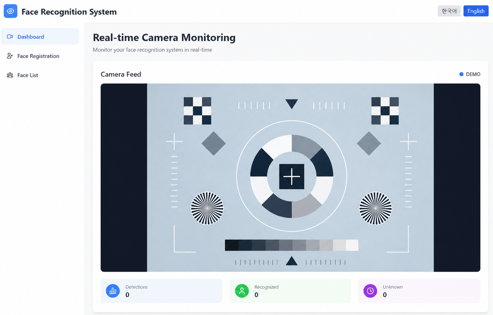
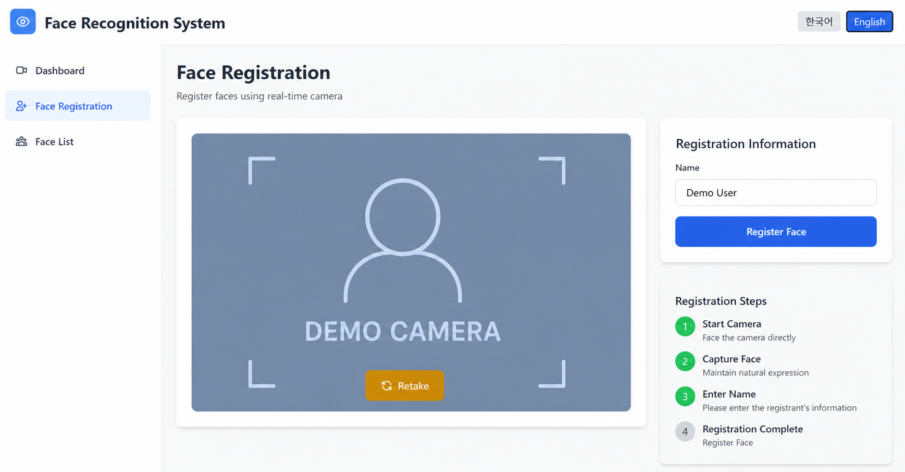
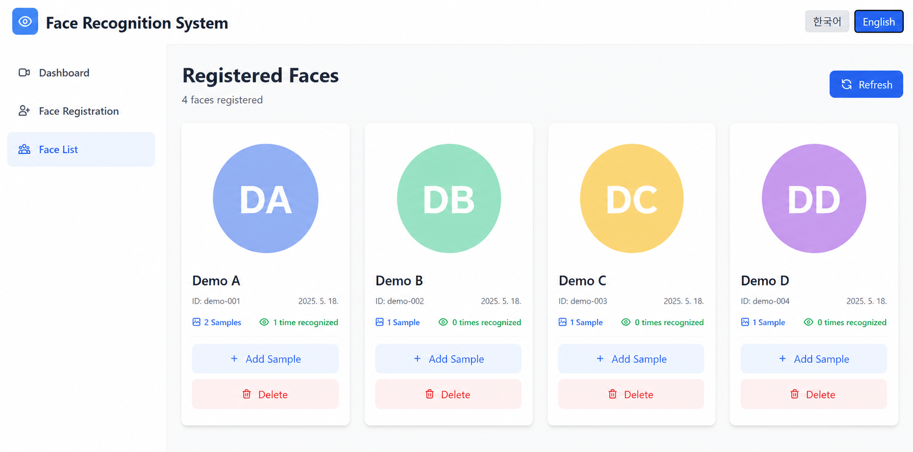

# Face Recognition System

Real-time face detection and recognition system

[한국어 문서](./README.kr.md)

## Project Overview
A system providing real-time face recognition through camera integration and a web-based dashboard.

## Key Features
- Real-time camera integration
- Face recognition using Hugging Face models
- Web-based monitoring dashboard
- Face registration and management
- Multi-sample face matching for improved accuracy
- Real-time statistics (detected faces, recognized faces, FPS)

## Tech Stack
- **Backend**: Python 3.9+, FastAPI, OpenCV
- **ML**: InsightFace (buffalo_l), PyTorch
- **Frontend**: React 19, Vite, Tailwind CSS, React Router
- **Testing**: Playwright E2E Testing
- **DevOps**: Git, GitHub

## Documentation
- [PRD (Product Requirements)](./PRD.md)
- [Project Plan](./PROJECT_PLAN.md)
- [Learning Workbook](./LEARNING_WORKBOOK.md) - Technical learning guide for project managers
- [API Guide](./API_GUIDE_EN.md) - Authenticated FastAPI server usage guide
- [Security & Privacy Operations](./docs/SECURITY.md) - Required deployment, storage, credential, and incident controls
- [Troubleshooting Guide](./TROUBLESHOOTING.md) - Installation and execution issues

## Project Structure
```
faceReco/
├── backend/                # Backend server
│   ├── app.py             # Main application
│   ├── models/            # ML model modules
│   │   ├── face_detection.py      # Haar Cascade face detection
│   │   ├── face_recognition.py    # InsightFace face recognition
│   │   └── face_database.py       # Face database management
│   ├── camera/            # Camera processing module
│   ├── api/               # API endpoints
│   ├── data/              # Face database
│   │   ├── face_database.json     # Metadata
│   │   ├── embeddings/            # Face embeddings (512-dim)
│   │   └── faces/                 # Face images
│   └── requirements.txt   # Python dependencies
├── frontend/              # Frontend (React + Vite)
│   ├── src/
│   │   ├── components/         # UI components
│   │   ├── pages/              # Pages (Dashboard, FaceRegistration, FaceList)
│   │   ├── services/           # API services
│   │   └── utils/              # Utilities
│   ├── tests/                  # Playwright E2E tests
│   └── package.json
├── docs/                  # Documentation
├── tests/                 # Test code
├── PRD.md                 # Product Requirements
├── PROJECT_PLAN.md        # Project Plan
└── README.md              # This file
```

## Project Status
Current Status: **Milestone 5 - Web Dashboard Development In Progress** 🚧

### Completed Tasks
**Milestone 1: Initial Project Setup** ✅
- [x] GitHub repository creation
- [x] Project directory structure setup
- [x] Python virtual environment configuration
- [x] Basic dependency package installation
- [x] Documentation (PRD, PROJECT_PLAN, README)

**Milestone 2: Camera Integration and Basic Face Detection** ✅
- [x] OpenCV camera handler implementation
- [x] Real-time video stream processing
- [x] Haar Cascade face detection implementation
- [x] Face region bounding box display
- [x] Unit test creation

**Milestone 3: ML Model Integration** ✅
- [x] InsightFace buffalo_l model selection
- [x] FaceRecognizer class implementation (face embedding extraction)
- [x] FaceDatabase class implementation (face database management)
- [x] Face registration feature implementation
- [x] Face recognition and matching feature implementation
- [x] Unit test creation

**Milestone 4: Backend API Development** ✅
- [x] FastAPI project initialization
- [x] API endpoint design and implementation
- [x] CORS configuration
- [x] Real-time video streaming API
- [x] Face registration/query/deletion API
- [x] API documentation (Swagger UI)
- [x] Real-time statistics API

**Milestone 5: Web Dashboard Development** 🚧
- [x] React + Vite frontend project initialization
- [x] Basic layout structure (Header, Sidebar, Layout)
- [x] Page components (Dashboard, FaceRegistration, FaceList)
- [x] API client setup (Axios)
- [x] Real-time camera monitoring with statistics
- [x] Face registration page with camera capture
- [x] Face list management with duplicate detection
- [x] Playwright E2E testing setup
- [ ] Comprehensive testing and optimization

### Next Steps
- [ ] Integration testing and performance optimization (Milestone 5)
- [ ] Deployment documentation and Docker containerization (Milestone 6)

## Getting Started

### Prerequisites
- Python 3.8 or higher
- Git
- Webcam (for camera features)
- Node.js 18+ (for frontend)

### Installation

1. **Clone Repository**
   ```bash
   git clone https://github.com/quirinal36/faceReco.git
   cd faceReco
   ```

2. **Create and Activate Python Virtual Environment**
   ```bash
   # Create virtual environment
   python3 -m venv venv

   # Activate virtual environment (Linux/Mac)
   source venv/bin/activate

   # Activate virtual environment (Windows)
   venv\Scripts\activate
   ```

3. **Install Dependencies**
   ```bash
   cd backend

   # Option 1: Production environment (recommended)
   pip install -r requirements.txt

   # Option 2: Minimal install (for quick testing)
   pip install -r requirements-minimal.txt

   # Option 3: Development environment (for developers)
   pip install -r requirements-dev.txt
   ```

   **Requirements File Descriptions**:
   - `requirements.txt` - Production environment (full features)
   - `requirements-minimal.txt` - Minimal environment (fast install, limited features)
   - `requirements-dev.txt` - Development environment (includes testing, linting, documentation tools)

   **Important**: InsightFace installation issues may occur on Windows.
   - **Recommended Solution**: Refer to Solution 1 or 2 in [Troubleshooting Guide](./TROUBLESHOOTING.md)
   - Install Visual Studio Build Tools or use Conda environment

4. **Verify Installation**
   ```bash
   # Check installed packages
   python test_installation.py
   ```

   **Model provisioning**: Download and verify InsightFace artifacts on a controlled
   staging/build host, then place the frozen bundle at
   `$FACERECO_MODEL_ROOT/models/buffalo_l/*.onnx` on the edge (or set an approved
   `FACERECO_MODEL_NAME` with the matching directory). A production edge must not
   download models at runtime;
   see [Security & Privacy Operations](./docs/SECURITY.md#model-artifacts-and-egress).

### Required Local Security Configuration

The server fails closed unless two different random bearer credentials of at
least 32 characters are configured. For a temporary local development shell:

```bash
export FACERECO_OPERATOR_TOKEN="$(python -c 'import secrets; print(secrets.token_urlsafe(48))')"
export FACERECO_DEVICE_TOKEN="$(python -c 'import secrets; print(secrets.token_urlsafe(48))')"
export FACERECO_CORS_ORIGINS="https://127.0.0.1:5173"
```

Use protected `FACERECO_OPERATOR_TOKEN_FILE` and
`FACERECO_DEVICE_TOKEN_FILE` settings for a managed service. The credentials
represent different roles: `operator` performs enrollment, browsing, deletion,
camera, and attendance management; the one local `device` credential is limited
to liveness operations. The browser asks for one credential and keeps it only in
the current tab's session storage after verifying `/api/auth/whoami`.

Never put a bearer token in a URL or a Vite `VITE_*` variable. The checked-in
[`.env.example`](./.env.example) contains deliberately invalid placeholders and
is not loaded automatically. Read the [security guide](./docs/SECURITY.md) before
provisioning persistent credentials, enabling LAN/VPN access, or running in
production.

### Running the Application

#### 🚀 Quick Start (Recommended)

**Method 1: Using npm scripts** (Most convenient)
```bash
# Install frontend dependencies (first time only)
npm run install-all

# Run backend + frontend simultaneously
npm run dev
```

**Method 2: Using run scripts**
```bash
# Windows
start-dev.bat

# Linux/Mac
./start-dev.sh
```

After server starts:
- **Frontend**: https://127.0.0.1:5173
- **Backend API**: http://127.0.0.1:8000
- **API Docs (development only)**: http://127.0.0.1:8000/docs

The API binds to loopback by default. Never publish it to the internet or use
`0.0.0.0`. A specific trusted development LAN/VPN address requires the explicit
non-loopback opt-in described in the security guide; production remains
loopback-only and interacts with Edu Manager through outbound HTTPS only.

---

#### Individual Execution (Manual)

**Virtual environment activation required**:
```bash
source venv/bin/activate  # Linux/Mac
# or
venv\Scripts\activate     # Windows
cd backend
```

#### 1. Face Registration (Add new faces)
```bash
python app.py --mode register --camera-id 0
```
- Spacebar: Capture face
- Enter name and press Enter
- q: Exit

#### 2. Face Recognition (Real-time recognition)
```bash
python app.py --mode face_recognition --camera-id 0
```
- Registered faces: Green box + name + confidence
- Unregistered faces: Red box + "Unknown"
- q: Exit

#### 3. Face Detection Demo (Haar Cascade)
```bash
python app.py --mode face_detection --camera-id 0
```

#### 4. Camera Test
```bash
python app.py --mode camera --camera-id 0
```

#### 5. API Server (FastAPI) 🆕
```bash
# Method 1: Using app.py
python app.py --mode server

# Method 2: Direct server.py execution
python server.py
```

After server starts:
- **API Docs (development only)**: http://127.0.0.1:8000/docs
- **ReDoc (development only)**: http://127.0.0.1:8000/redoc
- **Health Check**: http://127.0.0.1:8000/api/health

**API Endpoints**:
- `POST /api/face/register` - Register face
- `GET /api/faces/list` - List registered faces
- `GET /api/faces/{id}/thumbnail` - Fetch an operator-authorized thumbnail
- `DELETE /api/face/{id}` - Delete face
- `GET /api/camera/stream` - Real-time video streaming
- `GET /api/camera/stats` - Real-time statistics
- `POST /api/faces/merge` - Merge duplicate faces

Except for the minimal health check, API requests require an operator or device
`Authorization: Bearer ...` header. For detailed role and request examples, see
the [API Guide](./API_GUIDE_EN.md).

#### 6. Individual Module Execution
```bash
# Test camera handler
python -m camera.camera_handler

# Face detection demo
python -m models.face_detection

# Face recognition module test
python -m models.face_recognition
```

**Notes**:
- Webcam access permission required
- Press 'q' to exit the program
- Camera access may be restricted in WSL environments

### Development Environment Setup

1. **Code Formatting**
   ```bash
   # Code formatting with Black
   black backend/
   ```

2. **Running Tests**
   ```bash
   # Backend tests with pytest
   pytest tests/

   # Frontend E2E tests with Playwright
   cd frontend
   npx playwright test
   ```

## Development Guide

### Development Workflow
1. Create or select an issue
2. Create new branch (`git checkout -b feature/issue-name`)
3. Write code and tests
4. Commit and push
5. Create Pull Request

### Coding Style
- Python: Follow PEP 8, use Black formatter
- Write docstrings for functions and classes
- Write test code (recommended)
- React: Use functional components with hooks

### Testing
- **Backend**: pytest for unit tests
- **Frontend**: Playwright for E2E tests
- Test coverage goal: >80%

## GitHub Issues and Milestones
Project progress can be tracked at [GitHub Issues](https://github.com/quirinal36/faceReco/issues).

### Milestones
- **Milestone 1**: Initial Project Setup ✅
- **Milestone 2**: Camera Integration and Basic Face Detection ✅
- **Milestone 3**: ML Model Integration ✅
- **Milestone 4**: Backend API Development ✅
- **Milestone 5**: Web Dashboard Development 🚧
- **Milestone 6**: Integration and Deployment Preparation

## Screenshots

### Dashboard - Real-time Face Monitoring

The main dashboard provides real-time face detection and recognition with live statistics including detected faces count, recognized faces count, and processing speed (FPS).

### Face Registration

Register new faces through the web interface with camera capture and multi-language support.

### Face List Management

View and manage all registered faces with options for deletion and duplicate detection.

## Features

### Multi-Sample Face Recognition
- Register multiple photos of the same person for improved accuracy
- Automatic duplicate detection and merging
- Uses maximum similarity among all samples for recognition

### Real-time Statistics Dashboard
- Live face detection count
- Recognition success rate
- Processing speed (FPS)
- Updated every second

### Comprehensive Testing
- Playwright E2E tests for frontend
- Webcam mocking for testing without hardware
- API integration tests

### Internationalization (i18n)
- Multi-language support (English/Korean)
- Easy language switching
- Localized UI components

## How to Use

### 1. Initial Setup
1. Clone the repository and install dependencies (see [Installation](#installation))
2. Provision the two bearer roles in
   [Required Local Security Configuration](#required-local-security-configuration).
3. Start both backend and frontend servers:
   ```bash
   npm run dev
   ```
4. Access the web dashboard at https://127.0.0.1:5173 and enter the appropriate
   operator or device credential when prompted. The credential remains in the
   current browser tab's session only.

### 2. Registering Faces
1. Navigate to **Face Registration** page from the sidebar
2. Allow camera access when prompted
3. Position your face in the camera view
4. Click **Capture** button to take a photo
5. Enter a name for the person
6. Click **Register** to save the face

**Tips:**
- Ensure good lighting for better recognition
- Capture multiple angles for improved accuracy
- Keep your face centered in the frame

### 3. Monitoring Dashboard
1. Go to the **Dashboard** page
2. The system will automatically start detecting and recognizing faces
3. View real-time statistics:
   - **Detected Faces**: Total faces detected in the current frame
   - **Recognized Faces**: Number of faces matched with registered persons
   - **FPS**: Processing speed in frames per second

**Camera Feed:**
- Green boxes: Recognized faces (with name and confidence score)
- Red boxes: Unregistered/unknown faces

### 4. Managing Registered Faces
1. Navigate to **Face List** page
2. View all registered faces with their details
3. Use the **Delete** button to remove faces
4. System automatically detects duplicate entries

### 5. Testing Without a Camera
The system includes Playwright E2E tests that work without physical hardware:
```bash
cd frontend
npm test
```

### 6. API Integration
For developers integrating with the backend API:
- **Development API Documentation**: http://127.0.0.1:8000/docs
- **Development ReDoc**: http://127.0.0.1:8000/redoc
- Send bearer credentials only in the `Authorization` header; never use a URL
  query token.
- See [API Guide](./API_GUIDE_EN.md) for role-aware endpoint documentation.

## License
TBD

---
Last Updated: 2026-02-09
